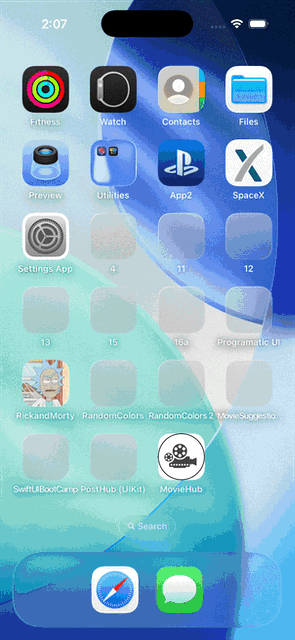
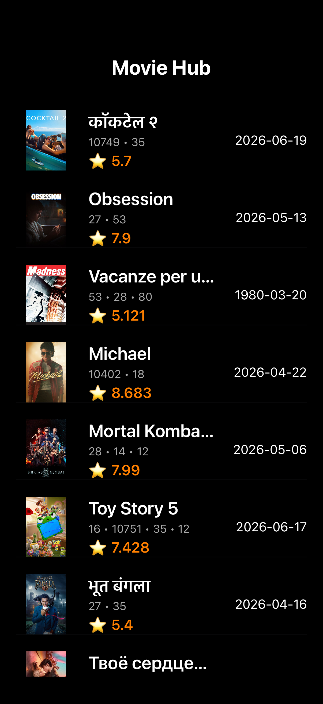
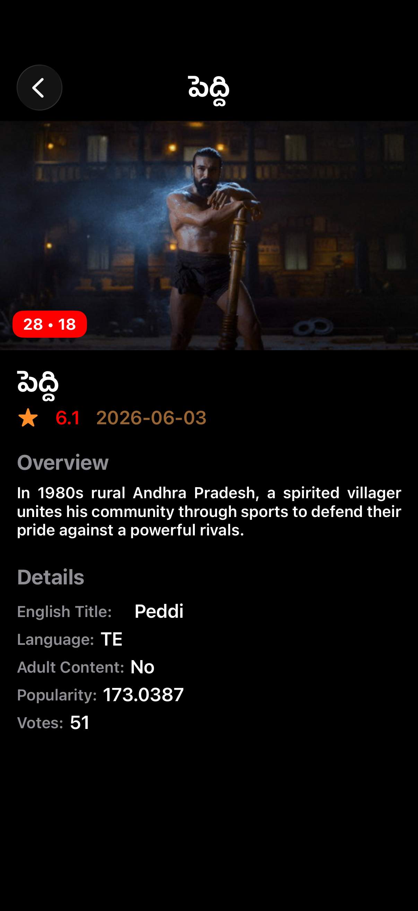

<!-- markdownlint-disable MD033 MD041 -->

<div align="center">

# 🎬 MovieHub

**A sleek, dark-themed iOS app for discovering movies — built entirely with UIKit and programmatic Auto Layout.**

MovieHub fetches the latest movies from [The Movie Database (TMDB)](https://www.themoviedb.org/) and presents them in a clean, scrollable list. Tap any title to dive into a full detail screen with the backdrop art, rating, overview, and metadata.

<br/>

[](https://www.apple.com/ios/)
[](https://swift.org)
[-2396F3?logo=swift&logoColor=white)](https://developer.apple.com/documentation/uikit)
[](https://developer.themoviedb.org/)
[](#-architecture)

</div>

---

## 📑 Table of Contents

- [Demo](#-demo)
- [ScreenShots](#-screenshots)
- [Features](#-features)
- [Tech Stack](#-tech-stack)
- [Architecture](#-architecture)
- [Project Structure](#-project-structure)
- [Getting Started](#-getting-started)
- [How It Works](#-how-it-works)
- [Offline / Mock Mode](#-offline--mock-mode)
- [Roadmap](#-roadmap)
- [Author](#-author)

---

## 🎞 Demo

<div align="center">



*Browse the movie list → tap a title → view full details.*

</div>

---

## 📸 ScreenShots

<div align="center">

| Movie Dashboard | Movie Details |
| :-------------: | :-----------: |
|  |  |
| A dark, edge-to-edge list of movies with poster, title, genres, rating and release date. | A scrollable detail view with backdrop banner, genre tag, rating, overview and metadata. |

</div>

---

## ✨ Features

- 🍿 **Discover movies** — pulls titles from TMDB's `discover/movie` endpoint.
- 🖤 **Dark, edge-to-edge UI** — a clean black theme tuned for browsing posters.
- 🗂 **Custom table cells** — each row shows poster art, title, genres, ⭐ rating and release date.
- 📄 **Rich detail screen** — backdrop banner, genre pill, rating, full overview, plus language, popularity, vote count, original/English title and adult-content flag.
- 🖼 **Asynchronous image loading** — posters and backdrops download on a background thread and update the UI smoothly.
- ⏳ **Loading state** — an activity indicator shows while data is fetched.
- ⚠️ **Graceful error handling** — typed `NetworkError` cases surface as user-facing alerts.
- 🧪 **Built-in mock layer** — swap the live network for bundled JSON to develop or test offline.
- 🧱 **100% programmatic UI** — no Storyboards (except the launch screen); layout is hand-written with reusable Auto Layout helpers.

---

## 🛠 Tech Stack

| Area | Choice |
| --- | --- |
| Language | Swift 6.0 |
| UI Framework | UIKit (fully programmatic Auto Layout) |
| Architecture | MVC + protocol-oriented networking |
| Networking | `URLSession`, generics, `Result`, `Codable` |
| Concurrency | Closures + `DispatchQueue` for main-thread UI updates |
| Remote API | [TMDB](https://developer.themoviedb.org/) (movies + image CDN) |
| Testing | XCTest (`MovieHubTests`, `MovieHubUITests`) |

---

## 🏗 Architecture

MovieHub follows a clean **MVC** structure with a **protocol-oriented network layer**, which keeps the live and mock implementations interchangeable.

```
        ┌──────────────────────────┐
        │     View Controllers     │   MoviesDashboardViewController
        │   (Dashboard / Details)  │   MovieDetailsController
        └────────────┬─────────────┘
                     │ requests data
                     ▼
        ┌──────────────────────────┐
        │      NetworkProtocol      │   generic  request<T: Decodable>(...)
        └─────┬───────────────┬────┘
              │               │
   ┌──────────▼──────┐  ┌─────▼──────────────┐
   │  NetworkManager │  │ MockNetworkManager │   (toggled by isInternetAvailable)
   │   (live TMDB)   │  │  (bundled JSON)    │
   └────────┬────────┘  └──────────┬─────────┘
            │                      │
            ▼                      ▼
        ┌──────────────────────────┐
        │     Codable Models       │   Movie / Movies
        └──────────────────────────┘
```

**Key design points**

- **`NetworkProtocol`** declares a single generic `request` method, so any conforming type can serve data.
- **`NetworkManager`** and **`MockNetworkManager`** are `Sendable` singletons that both conform to the protocol — switching between live and mock data is a one-line change.
- **`APIEndPoints`** centralizes the TMDB base paths (movies + images).
- **`UIImage.downloadImage(for:)`** is an extension that fetches poster/backdrop data asynchronously.
- **`ConstraintsHelper`** and **`UIElements`** provide reusable Auto Layout functions and view factories to keep the controllers readable.

---

## 📂 Project Structure

```
MovieHub/
├── AppDelegate.swift
├── SceneDelegate.swift              # Sets up the UINavigationController root
│
├── Constants/
│   ├── APIEndPoints.swift           # TMDB movie + image base URLs
│   ├── Cells.swift                  # Reuse identifiers
│   └── Error.swift                  # NetworkError enum
│
├── Modal/
│   └── MovieModal.swift             # Movie & Movies (Codable models)
│
├── NetworkManager/
│   ├── NetworkManager.swift         # Live TMDB networking (singleton)
│   └── Debug/
│       └── MockNetworkManager.swift # Offline / test networking
│
├── Controller/
│   ├── MoviesDashboardViewContrloller.swift  # Movie list screen
│   └── MovieDetailsController.swift          # Movie detail screen
│
├── View/
│   ├── Table Cells/
│   │   └── MovieCell.swift          # Custom MovieTableViewCell
│   └── Base.lproj/
│       └── LaunchScreen.storyboard
│
├── Extension/
│   └── UIImage.swift                # Async image download helper
│
├── Util/
│   ├── ConstraintsHelper.swift      # Reusable Auto Layout functions
│   └── UIElements.swift             # Label/button/imageView factories
│
├── MockData/
│   └── MoviesMockData.swift         # Bundled JSON for offline mode
│
└── Assets.xcassets/                 # App icon & colors

MovieHubTests/                       # Unit tests
MovieHubUITests/                     # UI tests
```

---

## 🚀 Getting Started

### Prerequisites

- **Xcode** (recent version with Swift 6 support)
- A **TMDB API key** — create a free account at [themoviedb.org](https://www.themoviedb.org/), then generate a key under **Settings → API**.

### Installation

1. **Clone the repository**

   ```bash
   git clone https://github.com/prem2279/MovieHub.git
   cd MovieHub
   ```

2. **Open the project in Xcode**

   ```bash
   open MovieHub.xcodeproj
   ```

3. **Add your TMDB API key**

   Open `MovieHub/NetworkManager/NetworkManager.swift` and replace the placeholder:

   ```swift
   private let apiKey = "add your api key"   // 👈 paste your TMDB API key here
   ```

4. **Build & run** — select a simulator (or your device) and press **⌘R**.

> 💡 No API key handy? Set `isInternetAvailable = false` in `MoviesDashboardViewController` to run against the bundled mock data instead. See [Offline / Mock Mode](#-offline--mock-mode).

---

## ⚙️ How It Works

1. On launch, **`SceneDelegate`** wraps `MoviesDashboardViewController` in a `UINavigationController` with a white, bold title.
2. **`MoviesDashboardViewController`** starts a loading spinner and calls `getData(for: .movies)`.
3. The request goes through **`NetworkProtocol`** — to the live `NetworkManager` when online, or `MockNetworkManager` when not.
4. The JSON response decodes into the **`Movies`** model (a list of `Movie` items) via `Codable`.
5. The table view reloads; each **`MovieTableViewCell`** renders its poster (downloaded asynchronously), title, genres, ⭐ rating and release date.
6. Tapping a row pushes **`MovieDetailsController`**, which loads the backdrop banner, genre pill, rating, overview and a details stack (language, popularity, votes, English title, adult-content flag).
7. Any failure maps to a typed `NetworkError` and is shown to the user in an alert.

---

## 🔌 Offline / Mock Mode

MovieHub ships with a mock network layer so you can develop and test without hitting the live API.

In `MoviesDashboardViewController`:

```swift
let isInternetAvailable = true   // set to false to use bundled mock JSON
```

When `false`, requests are served by `MockNetworkManager`, which decodes the sample payload from `MockData/MoviesMockData.swift`. This is handy for:

- Working without a TMDB API key
- Writing deterministic unit/UI tests
- Building the UI on a flaky or offline connection

---

## 🗺 Roadmap

Ideas for future iterations:

- [ ] Map genre IDs to human-readable genre names
- [ ] Search and filtering
- [ ] Pagination / infinite scroll (TMDB returns thousands of pages)
- [ ] Image caching to avoid re-downloads
- [ ] Pull-to-refresh
- [ ] Move the API key into a secure config (xcconfig / `.gitignore`) instead of source
- [ ] Migrate networking to `async/await`
- [ ] Expand unit & UI test coverage

---

### Updating the screenshots

Real captures always look best. To refresh the visuals:

1. Run the app in the iOS Simulator.
2. Capture stills with **⌘S** (saved to your Desktop), or record a screen video with `xcrun simctl io booted recordVideo demo.mov`.
3. Convert a recording to a GIF if desired (e.g. with [Gifski](https://gif.ski/) or `ffmpeg`).
4. Replace the files in the [`ScreenShots/`](ScreenShots) folder, keeping the same names (`dashboard.png`, `details.png`, `demo.gif`).

---

## 👤 Author

**Prem G**
GitHub: [@prem2279](https://github.com/prem2279)

---

<div align="center">

If you find this project useful, consider giving it a ⭐ on [GitHub](https://github.com/prem2279/MovieHub)!

<sub>Movie data provided by <a href="https://www.themoviedb.org/">The Movie Database (TMDB)</a>. This product uses the TMDB API but is not endorsed or certified by TMDB.</sub>

</div>
